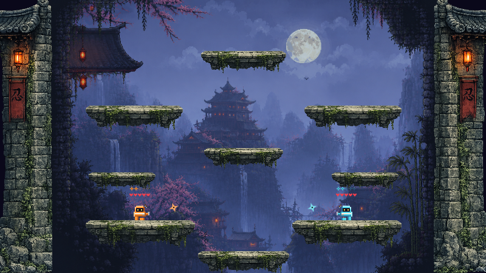

# Ninja Clash

A 2D single-screen arena fighter for 1–4 players, built in **Godot 4.6 / GDScript**.
Throw shurikens, dash-dodge to catch them out of the air, retrieve spent blades, and be the
last ninja standing. TowerFall-inspired, built for the couch — with host-authoritative
online 1v1.

**Browser version:** [create your Vercel project and invite a friend](web/SETUP.ru.md).



| | |
|---|---|
| **Engine** | Godot 4.6 · GDScript · Forward+ · GodotPhysics2D · 800×450 |
| **Players** | 1–4 local (2 keyboard schemes + up to 4 gamepads) · 1v1 online |
| **Content** | 4 arenas · 4 clans · 15 skins · 3 AI difficulty tiers · 9 match variants |
| **Networking** | Host-authoritative, 30 Hz snapshots · desktop ENet · browser WebRTC rooms (service setup required) |
| **Tests** | 46 GUT unit tests across 10 suites, all passing |
| **Targets** | macOS · Windows · Linux · Web (WASM, live) |

---

## Repository layout

| Path | Contents |
|---|---|
| [`ninja_clash/`](ninja_clash/) | The game — Godot project, GDScript sources, sprites, audio, tests |
| [`ninja_clash/docs/`](ninja_clash/docs/) | Design docs, architecture decision records, production history |
| `build/ninja-clash/` | Exported web build (not tracked) |

**Start here:** [`ninja_clash/README.md`](ninja_clash/README.md) — controls, mechanics,
architecture, how to run and test it.

## Running it

1. Open **Godot 4.6** → **Project ▸ Import** → select `ninja_clash/project.godot`
2. Press **F5** (main scene: `Main.tscn`)

Or headless: `/Applications/Godot.app/Contents/MacOS/Godot --path ninja_clash`

Export presets and the web deploy pipeline: [`ninja_clash/EXPORT.md`](ninja_clash/EXPORT.md).

Import this repository into Vercel with preset **Other** and Root Directory **./**.
The root configuration builds Godot 4.6.2 and deploys the game together with the room API.
Browser invitations require Redis and TURN environment variables. See the
[step-by-step setup guide (Russian)](web/SETUP.ru.md).

## Tests

```bash
/Applications/Godot.app/Contents/MacOS/Godot --headless --path ninja_clash \
    -s res://addons/gut/gut_cmdln.gd -gconfig=res://.gutconfig.json
```

The menu integration check covers selection, previews, mouse input, modal blocking,
and pause/resume:

```bash
/Applications/Godot.app/Contents/MacOS/Godot --headless --path ninja_clash \
    -s res://tests/integration/menu_flow.gd
```

## Documentation

| Document | What it covers |
|---|---|
| [Game overview](ninja_clash/docs/GAME.md) | The design vision, and where the build diverges from it |
| [Design docs](ninja_clash/docs/gdd/) | Per-system GDDs and the systems index |
| [Architecture decisions](ninja_clash/docs/architecture/) | ADR-0001 input/state separation · ADR-0002 prototype promotion · ADR-0003 online |
| [Art bible](ninja_clash/docs/art-bible.md) | Visual direction and asset standards |
| [Prototype report](ninja_clash/REPORT.md) | The PROCEED decision, with its caveats |
| [Production history](ninja_clash/docs/production/) | Sprint plans, retrospective, milestone |

---

## How this was built

This project was built with **Claude Code as a pair programmer**, and the git history
reflects that — a number of commits carry an AI co-author trailer. I am stating this up
front rather than leaving it to be discovered, because it is a fair question to ask of any
recent codebase.

What that means in practice, and what it does not:

- **I owned the direction.** Game feel, the balance decisions, what got cut and what
  shipped — those came from playing the thing repeatedly and deciding it wasn't right yet.
  The 5 HP / katana departure from the original one-hit-kill design (documented in
  [GAME.md](ninja_clash/docs/GAME.md)) is an example: a design change made by playing, not
  by prompting.
- **I owned the architecture.** The three ADRs in
  [`ninja_clash/docs/architecture/`](ninja_clash/docs/architecture/) are the decisions I
  consider the substance of this project. ADR-0001 — routing all simulation input through a
  single per-tick snapshot instead of reading devices directly — is the one that mattered:
  it was written before there was any online mode, and it is the reason adding
  host-authoritative multiplayer later was a feed-swap rather than a rewrite.
- **I owned knowing when a plan was wrong.** ADR-0002 records abandoning a from-scratch
  rewrite two sprints in, after it became clear it was re-implementing already-validated
  behaviour. Killing your own plan is a decision, and it is written down with the reasoning.
- **The documentation is not decoration.** The sprint history, the retrospective and the
  prototype report include the parts that did not go well — including, in
  [REPORT.md](ninja_clash/REPORT.md), an explicit note that no formal multi-tester playtest
  was ever run and that the PROCEED verdict is therefore developer confidence, not measured
  data.

Where I would push back on my own work: `player.gd` is 2,100 lines and should be several
files; sound effects are still procedural beeps; test coverage deliberately targets the
deterministic parts and leaves game feel to manual play. These are listed in the
[known limitations](ninja_clash/README.md#known-limitations) section rather than left for
someone to find.

---

## License

[MIT](LICENSE) — covers the code.

The music tracks under `ninja_clash/audio/` were **generated with Suno AI** under a paid
subscription that grants commercial use. They are deliberately left outside the MIT grant:
MIT would let anyone redistribute and resell them, which is a broader permission than the
subscription passes on. Use of the tracks is reserved.
