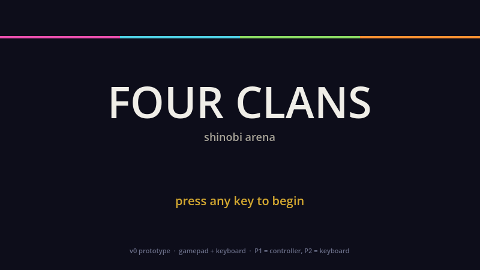
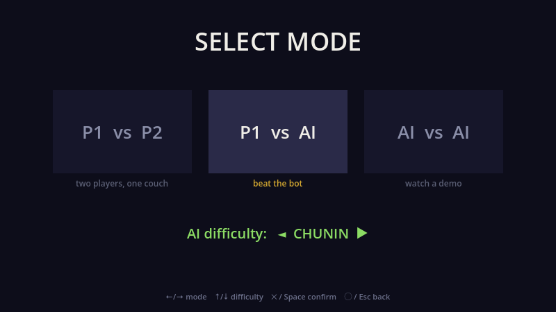
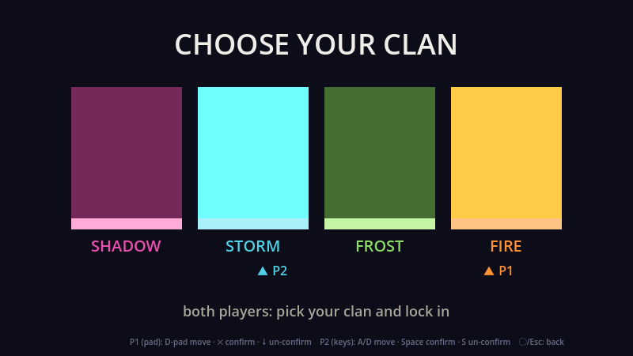

# Ninja Clash

A 2D single-screen arena fighter for 1–4 players, built in **Godot 4.6 / GDScript**.
Throw shurikens, dash-dodge to catch them out of the air, retrieve spent blades, and be
the last ninja standing. TowerFall-inspired, built for couch play — with 2–4-player LAN/online play.

**▶ Play in the browser: https://ninja-clash-ffay.vercel.app**


| Title | Mode select | Clan select | Map select |
|---|---|---|---|
|  |  |  |  |

> The in-game wordmark reads **FOUR CLANS** — the design documents' working title. The
> project ships as Ninja Clash. Same game.

---

## Contents

- [Feature overview](#feature-overview) · [Running it](#running-it) · [Controls](#controls)
- [Mechanics](#mechanics) · [Match flow](#match-flow) · [Fight Setup](#fight-setup-variants)
- [Online play](#online-play) · [Architecture](#architecture) · [Tests](#tests)
- [Project layout](#project-layout) · [Known limitations](#known-limitations)

---

## Feature overview

| | |
|---|---|
| **Players** | 1–4 local (keyboard ×2 + up to 4 gamepads), or 2–4 humans online |
| **Arenas** | 4 — Sakura Temple, Neo Tokyo, Verdant Cistern, Sky Temple |
| **Clans** | 4 — Shadow, Storm, Frost, Fire |
| **Skins** | 15 original appearance styles with expanded movement animations, in all 4 clan colours |
| **Modes** | P1 vs P2 · P1 vs CPU · P1 vs 3 CPUs (free-for-all) · Online 2–4 players |
| **AI** | 3 tiers — Genin, Chunin, Jonin |
| **Rulesets** | Fight Setup screen — configurable combat and round-time rules, persisted between sessions |
| **Audio** | Dedicated Music/SFX buses, arena music, synthesized effects and file overrides |
| **Tests** | GUT unit tests, native integration fixtures and Playwright browser checks |
| **Targets** | macOS · Windows · Linux · Web (WASM, live) |

---

## Running it

**From source**

1. Open **Godot 4.6**.
2. **Project ▸ Import** → select `project.godot` in this directory.
3. Press **F5**. If prompted for a main scene, pick `Main.tscn`.

**Headless, from a terminal**

```bash
/Applications/Godot.app/Contents/MacOS/Godot --path ninja_clash
```

Plug in gamepads before launching — they are detected on hot-plug too. DualSense and
Xbox pads both work; button constants are positional, so one mapping covers both.

---

## Controls

The animated welcome opens automatically. Press **Enter**, **Space**, or **A / Cross** to skip it.
Use the **D-pad / left stick** to select menu buttons, **A / Cross** to confirm, and
**B / Circle** to go back or skip the intro. The selected button has a gold outline.
Local Multiplayer lets 2–4 people select unique clans and play together. The two keyboard layouts cover P1 and P2; controllers fill the remaining slots. For four players, use two keyboard layouts plus two controllers, one keyboard layout plus three controllers, or four controllers. The optional tutorial is off by default. Standard loadouts are 3 shurikens, 3 katana charges and 5 HP.

All connected controllers can navigate shared menus, including controllers plugged in after launch.
After the welcome, room invitations continue to the online menu.
The online name field still uses keyboard text entry; its Back and Continue buttons support the controller.
Browsers may require a click or keyboard press to enable audio even when starting with a controller
([Godot web limitations](https://docs.godotengine.org/en/stable/tutorials/export/exporting_for_web.html#audio)).

Bindings are built at runtime in `input_bindings.gd` — there are no bindings
stored in `project.godot`, so gamepad assignment can be re-derived on every hot-plug.

### Keyboard — Player 1 (WASD)

| Action | Key |
|---|---|
| Move / aim | **W A S D** (arrow keys also work) |
| Jump | **Space** |
| Throw shuriken | **L** — hold to aim, release to fire |
| Katana | **K** |
| Guard | **J** — hold to block incoming hits from the front |
| Dash-dodge | **Left Shift** |
| Menu confirm | **Enter** · Cycle skin **P** |

### Keyboard — Player 2 (numpad, Num Lock on)

| Action | Key |
|---|---|
| Move / aim | **4 / 6** left/right · **8 / 5** up/down |
| Jump | **0** |
| Throw shuriken | **1** |
| Katana | **2** |
| Guard | **3** |
| Dash-dodge | **+** |
| Menu confirm | **numpad Enter** · Cycle skin **7** |

### Gamepad — up to 4 pads

TowerFall-on-PlayStation layout. First connected pad → P1, second → P2, and so on.

| Action | Button |
|---|---|
| Move / aim | **D-pad** or **Left Stick** |
| Jump | **Cross ✕** |
| Throw shuriken | **Square ▢** — hold to aim, release to fire |
| Katana | **Triangle △** |
| Dash-dodge | **Circle ◯**, **L1** or **R1** |
| Guard | **L2** · Dash **R2** |

### Global

**Esc** / **Circle ◯** back · **Esc** / **Start** pause · **Tab** / **Select** Fight Setup ·
**X** / **Triangle △** random map

A **HOW TO PLAY** overlay covers all three schemes on the first round of a match. It can be
switched off in *Options* or *Pause ▸ Settings*; the choice persists.

---

## Mechanics

### Movement
Single jump (no double jump), **wall grab** and **wall jump**, **head-stomp** for a damaging
bounce, and **screen wrap** — fall off the bottom and reappear at the top.

### Dash-dodge
The dash and the dodge are one move: an 8-way burst with gravity suspended for its duration,
carrying brief **invincibility frames** that **catch** an incoming shuriken straight into your
stash (or deflect it if the stash is full). Timing matters — short i-frames followed by a
**~0.42 s cooldown** mean you must dash *just before* the hit lands. Airborne you get one
charge until you touch a floor or wall.

### Throwing
**Hold** to aim: a clan-coloured reticle shows which of the 8 directions you are committed
to, and you stand still while aiming on the ground. **Release** to fire. A quick tap is a
quick-draw in the facing direction. Hold duration does not affect throw speed.

### Combat
**5 HP** per life, shown as hearts. Shurikens, katana hits and head-stomps deal **1 damage**
each. Stash starts at **3** blades and caps at **5**. The **katana** has 3 charges: swings
deflect shurikens for free and cost a charge only on a hit. **Guard** holds the blade up to
block frontal hits. Shuriken-vs-shuriken collisions produce a **clash** — a brief hitstop
with a lightning flash and a push-apart recoil.

Blades leave the round **only on a clean damaging hit**. Deflects, clashes and misses all
stick somewhere and stay retrievable, so ammo thins out only when someone actually connects.

---

## Match flow

The game opens with a short animated welcome and proceeds automatically to the main
menu. Keyboard, mouse or controller input can skip it; invitation links continue into
the online join flow. Browser audio begins after user interaction.

1. **Title** → Start / Online / Options / Credits / Quit
2. **Mode select** — choose a mode; modes with CPU opponents then require a Genin / Chunin / Jonin choice
3. **Clan select** — pick clan and skin (**Tab** opens Fight Setup here)
4. **Map select** — Up/Down browses arenas and actions; confirm an arena to highlight **Fight**, then confirm again to start. **Random** runs a slowing carousel and highlights Fight on its result.
5. **Match** — first to the target score (default 5 round-wins); a round ends when one
   ninja is left standing, opening on a 3-2-1-FIGHT countdown
6. **Match end** — selected winner portrait, final round scores, and a per-player battle record; rematch, choose arena/clan, or return to title

---

## Fight Setup (variants)

A TowerFall-style variants screen reachable with **Tab** from clan select. Every value
defaults to standard rules, so an untouched setup plays exactly like the base game. Changes
persist to `user://match_config.cfg`.

| Variant | Range |
|---|---|
| Katana enabled / recharge mode / charges | on-off · per-round or finite · 0–9 |
| Shurikens enabled / starting count / infinite | on-off · 0–5 · on-off |
| Max HP | 1–9 |
| Rounds to win | 1–15 |
| Blade wave (charged katana projectile) | on-off |
| Round time | off or 30–300 seconds in 30-second steps; default 60 |

---

## Online play

LAN and internet **2–4 players** over ENet (default port **24565**), **host-authoritative**:

- client → host: input as intent bitmasks, every physics tick (unreliable)
- host → client: a world snapshot at **30 Hz**, plus reliable events for state changes,
  scores, lobby picks and FX cues

The host runs exactly the same simulation as a local match. Because `PlayerInputRouter`
already separates device reads from the simulation, the host feeds fighter slots 2–4
from independent network inputs instead of from keyboards — the simulation cannot tell the difference.
There is no client-side prediction: the client renders host-authoritative positions, so
input latency scales with ping. Wire formats live in `net_codec.gd` and are unit-tested.

Desktop online uses ENet and the host's IP address. The browser build uses **WebRTC**:
**Online Play → enter your name → Create Room → Copy Invite**. Up to three guests
open the same link, enter a name and choose **Join Room**. Each player picks a clan/skin
and presses **Ready**; the host explicitly starts with the connected 2–4 players.
Names remain in memory through rematches and connection failures, until leaving multiplayer.
Arena or rule changes clear readiness. The host can start with two or three players while
other seats remain empty. A guest departure returns the remaining players to the lobby;
the same invitation can admit a replacement. See [ADR-0005](docs/architecture/ADR-0005-online-party-lobby.md). A Vercel Function exchanges the handshake through Redis; gameplay travels
directly between browsers or through TURN when direct connectivity is blocked.
The host tab must remain active. Desktop IP sessions and browser rooms are separate transports.

The new browser mode requires deploying the room API and configuring Redis/TURN; exporting
the static game alone is insufficient. Follow [the setup guide](../web/SETUP.md).

Dev shortcuts: `-- --host`, `-- --join=<ip>`, `-- --online-autotest`.

---

## Architecture

See the [current runtime architecture](docs/architecture/README.md) for component boundaries and a code map.

Autoloads (`project.godot`):

| Autoload | Responsibility |
|---|---|
| `GameState` | Screen state machine, clan/skin selections, match progress |
| `PlayerInput` | The **only** reader of Godot Input for the simulation (ADR-0001) |
| `Combat` | Live-tunable combat levers + per-slot scoring |
| `Maps` | Arena registry — 4 maps as pure data |
| `Audio` | Music buses + SFX |
| `Settings` | Volume, fullscreen and tutorial prefs → `user://settings.cfg` |
| `MatchConfig` | Fight Setup ruleset → `user://match_config.cfg` |
| `Net` | Online session manager (ADR-0003) |

Three decisions shaped the codebase, each recorded as an ADR in [`docs/architecture/`](docs/architecture/):

- **[ADR-0001](docs/architecture/ADR-0001-input-state-separation.md)** — input/state separation.
  The simulation reads a captured per-tick intent snapshot, never the live device. This is
  what later made online multiplayer a feed-swap rather than a rewrite.
- **[ADR-0002](docs/architecture/ADR-0002-prototype-as-production-base.md)** — the prototype
  was promoted to the production base instead of being rewritten from scratch.
- **[ADR-0003](docs/architecture/ADR-0003-online-multiplayer.md)** — host-authoritative ENet 1v1.

Balance values are **data-driven**, not hardcoded: `player_tuning.tres` (a `PlayerTuning`
resource) and `bot_tuning.tres` feed `player.gd`, and can be injected in tests. A live
tuning panel exposes the five combat levers during a round.

The menu screens are built procedurally in code rather than as `.tscn` scenes, composed
from the pixel-art kit in `sprites/menu/`.

---

## Tests

Unit tests run with the bundled [GUT](https://github.com/bitwes/Gut) 9.6 runner:

```bash
/Applications/Godot.app/Contents/MacOS/Godot --headless --path ninja_clash \
    -s res://addons/gut/gut_cmdln.gd -gconfig=res://.gutconfig.json
```

Coverage focuses on the pure, deterministic parts — network codec, match-config
load/save/clamp, combat scoring, input intent, tuning integrity, settings persistence, map
data and bot decision logic. Pure-rule tests instantiate their dependencies directly; integration fixtures exercise
the actual scene and its autoloads.

Boot smoke test: `Godot --headless --path ninja_clash --quit-after 90`.

---

## Project layout

```
ninja_clash/
├── main.gd              # scene composition and round flow
├── player.gd            # fighter movement and combat state
├── fighter_presentation.gd # animation, inventory indicators and effects
├── input_bindings.gd    # keyboard layouts and controller assignment
├── arena_factory.gd     # map-node construction
├── shuriken.gd          # projectile + retrieval
├── net.gd, net_codec.gd # online session + wire format
├── maps.gd              # 4 arenas as data
├── *_select.gd          # title / mode / clan / map / setup / online screens
├── *_ambience.gd        # per-map parallax atmosphere layers
├── *_tuning.tres        # data-driven balance
├── docs/                # GDDs, ADRs, art bible, sprint history
├── sprites/, audio/     # assets
└── tests/unit/          # GUT suites
```

---

## Known limitations

Stated plainly, because they are real:

- **Online supports 2–4 humans**, with no client-side prediction — fine on LAN, input lag scales
  with ping over the internet.
- **Guest movement is interpolated, not predicted.** Internet latency remains visible.
- **Fighter movement and combat still share a simulation class.** Presentation, bot decisions,
  navigation, input routing and network packing are separate components.
- **Automated checks do not measure game feel.** Native and browser integration tests exercise
  real movement, combat and menus, but balance needs human playtesting.
- No formal multi-tester playtest has been run; tuning reflects extended solo and
  versus-bot iteration. See [`REPORT.md`](REPORT.md).

## Perks and round timing

Perks spawn at authored, reachable platform locations. Each pickup adds one independent
special throw: three ordinary shurikens plus a perk means four throws. The special icon
sits beside the ordinary stash and is consumed first, even when the ordinary stash is empty.
See [shuriken perks](docs/gdd/shuriken-perks.md) for reverse, seeker, swap and ricochet behavior.

Rounds default to 60 seconds. The sole highest-health survivor wins on timeout; tied
leaders continue at one heart for 20 seconds of sudden death. A surviving tie is a draw.
See [round clock](docs/gdd/round-clock.md) for configuration and authority rules.
