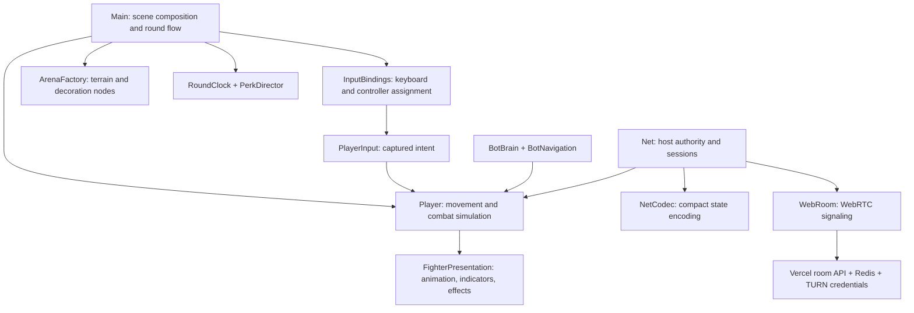

# Runtime architecture

The main scene composes a fixed arena, fighters and UI screens. Autoloads hold services
shared across screens; per-fighter and per-match objects have the lifetime of their owner.

## Boundaries

- [`main.gd`](../../main.gd) creates the scene, applies match selections, and resolves
  round transitions. It passes a parent to [`arena_factory.gd`](../../arena_factory.gd),
  which constructs map nodes without knowing about screens or scoring.
- [`input_bindings.gd`](../../input_bindings.gd) owns device mappings and hot-plug signals.
  [`player_input_router.gd`](../../player_input_router.gd) captures simulation intent
  once per tick. Menu navigation has its own UI input path.
- [`player.gd`](../../player.gd) owns movement, health, ammunition and combat state.
  [`fighter_presentation.gd`](../../fighter_presentation.gd) receives its actor explicitly
  and handles visual updates. It does not decide hits, grant perks or award scores.
  Keeping the existing fighter state layout also preserves the network codec contract.
- [`welcome_screen.gd`](../../welcome_screen.gd) animates a short greeting and emits
  `completed`. Main decides whether that leads to the title or an invitation's join flow.
  Keyboard, mouse and controller input can skip it without activating the next screen.
- [`net.gd`](../../net.gd) remains the session authority. [`net_codec.gd`](../../net_codec.gd)
  handles packed fighter/projectile state, [`online_roster.gd`](../../online_roster.gd)
  validates lobby membership, and [`web_room.gd`](../../web_room.gd) handles browser signaling.

These boundaries follow Godot's [scene organization guidance](https://docs.godotengine.org/en/4.6/tutorials/best_practices/scene_organization.html):
parents compose dependencies, focused components own their responsibilities, and screen
completion is communicated with a signal. The welcome uses a node-bound
[Tween](https://docs.godotengine.org/en/4.6/classes/class_tween.html), so its animation is
cleaned up with the screen and runs independently of combat time scale.

## Authority and ordering

The host advances combat, perk spawning and round expiry. Guests send intent and receive
world snapshots; they interpolate movement but never resolve hits or timer winners.
Reliable state transitions carry match rules and clock state. The client applies the clock
after changing the screen because round entry initializes the local clock.

Visuals read fighter state after simulation, including on interpolated remote fighters.
Perk ammunition remains separate from the ordinary stash and is consumed first. An
inventory update never changes the underlying ammunition count.

## Verification

- Unit suites cover codecs, rules, input, scoring, maps, bot decisions and timer boundaries.
- Native fixtures exercise collision, combat, perk ammunition, menus and match transitions.
- Browser tests exercise automatic/skipped welcome, audio after interaction, controller
  navigation and real 2–4 player WebRTC sessions.

See the [repository README](../../../README.md#run-checks) for commands. Historical ADRs
record decisions made at earlier stages; this document describes the current structure.
