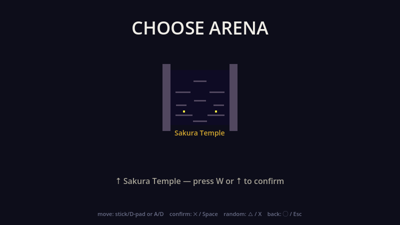

# Four Clans — Movement & Combat Prototype

**Status:** Prototype / vertical slice — throwaway code, standards intentionally relaxed.
**Engine:** Godot 4.6 · **Players:** local 2-player (gamepad or keyboard) · **Resolution:** 800×450.

**Hypothesis under test:** *Does the throw → dodge → retrieve loop feel fun in local 2-player play?*

---

## Screenshots

| Title | Clan select | Map select |
|---|---|---|
|  |  |  |

---

## What this is

A TowerFall-inspired couch-versus arena fighter. Two ninjas face off on a single
screen: throw shurikens, dodge to catch them out of the air, retrieve spent ammo,
and eliminate your opponent. It is built as a throwaway vertical slice to validate
the core combat *feel* before any production code is written.

---

## How to run

1. Open **Godot 4.6**.
2. **Project → Import →** select `project.godot` in this directory.
3. Press **F5** to launch. If prompted for the main scene, pick `Main.tscn`.

Plug in a controller before launching to play with a gamepad (recommended). A
DualSense (PS5) over USB or Bluetooth is detected automatically.

---

## Controls

### Gamepad — DualSense (primary)

Mapping follows the **TowerFall-on-PlayStation** layout. Player 1 = first connected
controller, Player 2 = second controller.

| Action | Button | Notes |
|---|---|---|
| Move / aim | **D-pad** or **Left Stick** | 8-directional; also aims throws and the dash |
| Jump | **Cross ✕** | double jump in air; wall-jump off walls; also confirms menus |
| Throw shuriken | **Square ▢** | hold a vertical direction to throw up/down |
| Dodge | **Circle ◯**, **L1**, **R1** | invincibility frames; catches incoming shurikens |
| Dash | **L2** or **R2** | 8-way burst toward the held direction (see *Dash* below) |
| Katana | **Triangle △** | melee swing; deflects shurikens, damages enemies |

### Keyboard (Player 2)

**Player 1 is controller-only** (use the gamepad table above). Player 2 plays on the keyboard:

| Action | Key |
|---|---|
| Move / aim left | **A** |
| Move / aim right | **D** |
| Aim up | **W** |
| Aim down | **S** |
| Jump | **Space** |
| Throw shuriken | **L** |
| Katana | **K** |
| Dodge | **Right Shift** |
| Dash | **double-tap A or D** |

P2's dash is a quick double-tap of a movement key (P2-only, so the gamepad stick can't
trigger it). On a gamepad, dash is L2/R2 as in the table above.

### Menu navigation (any controller or the keyboard, on every screen)

- **Title** — any key or any controller button begins
- **Move cursor** — D-pad / stick, or A/D
- **Confirm** — **Cross ✕** / Space
- **Back / cancel** — **Circle ◯** / Esc
- **Un-confirm** a clan pick — down (D-pad / S)
- **Random map** — **Triangle △** / X

---

## Core mechanics

### Movement
- **Run** at a fixed top speed; **double jump** (one ground + one air jump, refreshed on landing).
- **Wall grab**: hold *into* a wall while airborne to slide down slowly.
- **Wall jump**: jump while wall-grabbing for an upward kick away from the wall.
- **Head-stomp**: land on an opponent's head to deal damage and bounce off.
- **Screen wrap**: fall off the bottom and reappear at the top (and vice-versa).

### Dash (L2 / R2)
A short directional burst toward the held aim — 8-way, including straight up and
diagonals. Gravity is suspended for its duration so up/diagonal dashes hold a clean line.

- **One charge.** In the air you get exactly **one** dash; it does not return until
  you touch a **floor or wall** — so you cannot infinitely climb.
- **Ground cooldown ≈ 0.417 s** between dashes (TowerFall's 25-frame dodge cooldown).
- After spending the air dash, the charge returns **0.5 s after** you touch a surface.
- L2 and R2 are the *same* action — direction comes from the stick, not the trigger.

### Dodge (Circle / L1 / R1)
A horizontal dash with **invincibility frames**. While the i-frames are active (the
yellow flash) you are immune to all hits **and** you **catch** an incoming shuriken
straight into your stash (or reflect it if your stash is already full). This is the
signature defensive/retrieval move.

### Combat
- **5 HP** per life, shown as hearts above the ninja. Shurikens, katana hits, and
  head-stomps each deal **1 damage**; reaching 0 HP is an elimination.
- **Shuriken stash**: start with **3**, hold up to **5**. Throwing spends one; pick a
  spent shuriken back up by walking over it, or catch one mid-air with a dodge.
- **Katana**: **3 charges**. A swing **deflects** shurikens in front of you (free) and
  **strikes** an enemy for 1 damage (costs a charge).
- Brief hurt-invulnerability after a non-lethal hit prevents stun-locking.

---

## Match flow

1. **Title** — "FOUR CLANS". Press any input to begin.
2. **Clan select** — both players pick from **Shadow / Storm / Frost / Fire**
   (same-clan picks are rejected).
3. **Map select** — choose the arena.
4. **Match** — first to **5 eliminations** wins. Each round opens with a 3-2-1-FIGHT
   countdown, runs until one ninja is eliminated, pauses ~1.6 s on the winner, then repeats.
5. **Match end** — winning clan + final score; rematch or return to title.

---

## Map

**Sakura Temple** — a pagoda arena with layered platforms, lanterns, and a moonlit
backdrop. (Currently the only map in the prototype; spawn points are fixed.)

---

## Tuning knobs

A **live tuning panel** (sliders, bottom-left during a round) exposes the most
consequential balance levers:

1. **Dodge i-frame duration** (`0.20 s`)
2. **Shuriken throw velocity** (`600`)
3. **Pickup radius** (`12 px`)
4. **Self-hit immunity** window (`0.083 s`)
5. **Wall-grab fall speed** (`80`)

Dash feel is tuned by constants at the top of `player.gd`:
`SLIDE_SPEED` (400), `SLIDE_DURATION_S` (0.20), `SLIDE_COOLDOWN_S` (0.417),
`SLIDE_AIR_REFRESH_S` (0.5).

---

## Known limitations

- **Local 2-player only** — no online, no 4-player yet.
- **One map** (Sakura Temple).
- **Procedural beep SFX** generated at startup — no music or final sound design.
- Some **on-screen menu hints are stale** (e.g. they still list keyboard-only keys);
  the tables in this README reflect the actual bindings in `main.gd`.
- Maps and round flow are simplified prototype variants of the design-doc specs.

---

## After playtest

Record outcomes in [`REPORT.md`](REPORT.md). Decision criteria (from the concept doc):

- **PROCEED** — ≥3 of 5 first-time testers call the dodge timing "satisfying"/"fair" and voluntarily ask for a rematch.
- **PIVOT** — the loop works but a specific value or mechanic needs changing before MVP.
- **KILL** — the loop is not fun even with extreme tuning.
